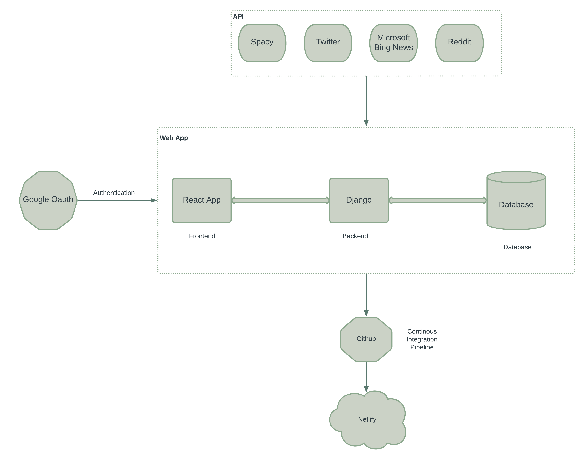

## Deployment URL :https://candid-blini-480f7c.netlify.app/

# final-project-proposal-lorem-ipsum

We wake up every morning & read our news through different channels.It maybe good old newspaper to some of us but most of us consume our daily news through newsletters & news websites or applications.
 With current affairs, comes a truck load of memes. A lot of us consume meme content on topics that we are interested in. A feed where you can access and consume memes based on current affairs related to one’s area of interest would be a great start to their day. 

# Functionality
 A basic crud application aspect of this idea would just be a collection of memes that could be accessed based on the category. The uniqueness of this concept is that data is being crawled and mapped to respective meme formats that are based on topical news items from platforms. A feed where we don’t just consume what is shown to us but one where we can filter and map what we care about to humor. 

# Concerns
As with various content consuming applications, users are trapped in a facade by attackers where malicious content is wrapped with normal functions of that application. Some concerns that might pop up are probable reflective XSS attacks where a user might be redirected to malicious links while accessing content on the feed. Certain user Information(personal) and user behavior might be compromised e

# Project Tech Stack

## System Design 

# Minimum Viable Product

We intend to implement a system which includes but is not restricted to a Backend API to search for news articles using Microsoft Bing News API. This will be used in order to obtain the current hot topics which is news for a particular day. From this information, key words for the current affairs will be extracted using Part-of -speech tagging via Spacy API. 

The next step is to use the obtained keywords to crawl for memes from platforms such as Reddit. To do so, we will hit the Reddit API and procure memes to map the news with memes for the same.
